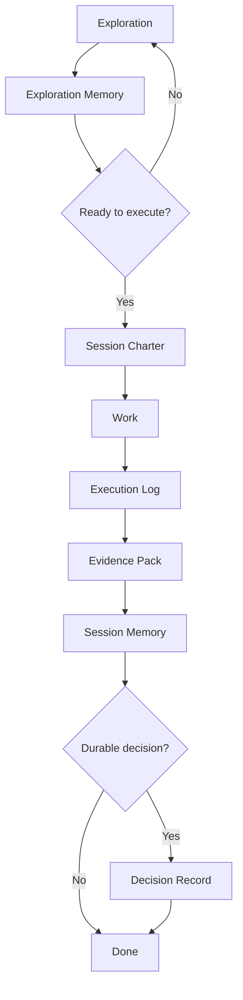

# Artifact System Index

This repository is driven by markdown artifacts.

The goal is simple: future agents should not have to rediscover context from chat history, screenshots, vague memory, or human recollection.

## Operating Principle

The repo is the source of truth.

If a decision, constraint, bug, test result, or lesson matters later, capture it in a markdown artifact.

## Lifecycle



## Artifact Types

| Artifact | Purpose | When Used | Location |
|---|---|---:|---|
| Exploration Memory | Preserve provisional orientation | End of exploration | `docs/artifacts/explorations/` |
| Session Charter | Define mission, scope, constraints, plan, proof | Before execution | `docs/artifacts/active/` |
| Execution Log | Track what actually happened while working | During execution | `docs/artifacts/active/` |
| Evidence Pack | Prove the outcome | Before done claim | `docs/artifacts/evidence/` |
| Session Memory | Durable handoff summary | End of execution | `docs/artifacts/memory/` |
| Decision Record | Record durable technical/product decisions | When a real decision is made | `docs/artifacts/decisions/` |
| Open Issue | Preserve unresolved known problems | When work cannot be closed cleanly | `docs/artifacts/open-issues/` |

## Naming Rules

Use stable, sortable names.

```text
EXP-YYYYMMDD-short-slug.md
CHARTER-YYYYMMDD-short-slug.md
EXEC-YYYYMMDD-short-slug.md
EVID-YYYYMMDD-short-slug.md
MEM-YYYYMMDD-short-slug.md
ADR-0001-short-slug.md
ISSUE-YYYYMMDD-short-slug.md
```

## Status Values

Use one of:

- Draft
- Active
- Blocked
- Completed
- Superseded
- Abandoned

## Markdown Header Contract

Every tracked artifact starts with YAML frontmatter required by `scripts/check_markdown_frontmatter.py`, followed by the artifact table near the top of the body:

```md
---
title: "Short artifact title"
when_to_read:
  - "When this artifact is relevant."
summary: "One-sentence summary."
ontology_relations:
  - relation: "documents"
    target: "path/to/artifact.md"
    note: "Why this artifact matters."
---

| Field | Value |
|---|---|
| Artifact Type |  |
| Status |  |
| Date | YYYY-MM-DD |
| Owner |  |
| Related Artifacts |  |
| Related Files |  |
```

## Rule of Thumb

Exploration memory = where thinking currently is.

Decision memory = what was agreed.

Execution memory = what actually happened.
