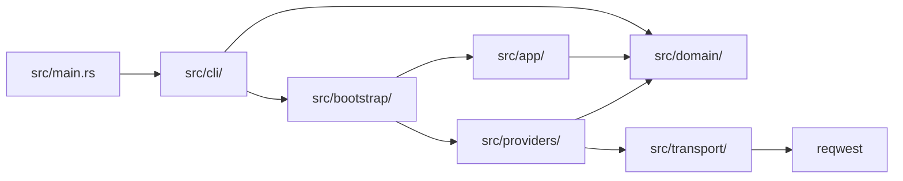

# Dependency Direction Visual

This is the high-level direction future changes should preserve.

Architecture boundary tests in `tests/architecture_test.rs` enforce the critical reverse-import bans.
